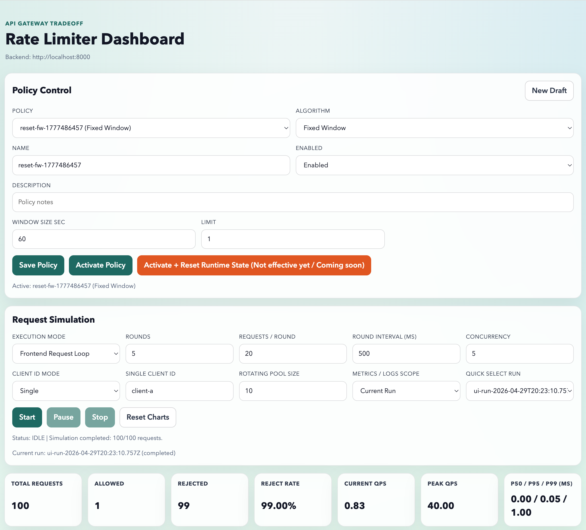
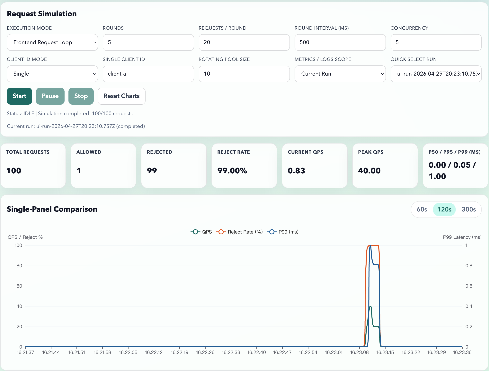
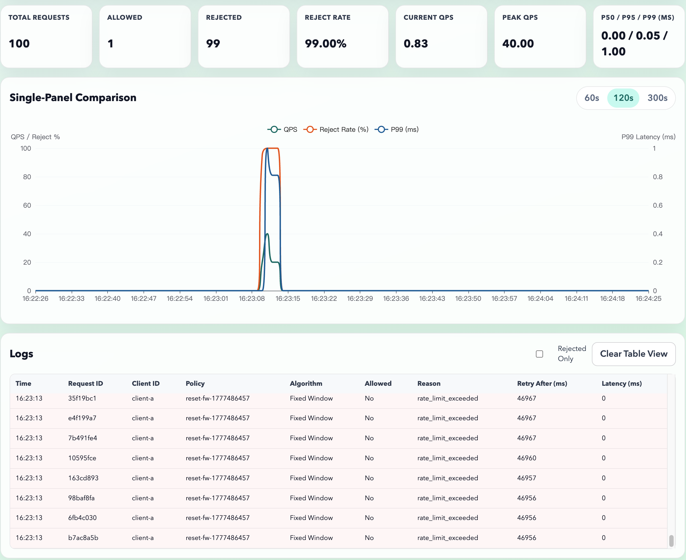

# API Gateway Rate Limiter Simulator

An industry-style, minimum-runnable simulation platform for comparing API gateway rate-limiting algorithms under controlled load.

## Project Description

This project provides an end-to-end environment to evaluate the behavior of five rate-limiting algorithms in a unified dashboard:

- Fixed Window
- Sliding Log
- Sliding Window Counter
- Token Bucket
- Leaky Bucket

The system is designed to make algorithm trade-offs visible through live request simulation, policy hot-switching, real-time metrics, and request-level logs.

## Architecture Overview

- **Backend**: FastAPI service with pluggable limiter engines
- **Runtime State**: Redis for counters, tokens, windows, and short-term metrics/log buffers
- **Policy Storage**: PostgreSQL for policy definitions, parameters, activation state, and optional experiment metadata
- **Frontend**: React + Vite dashboard for policy control, simulation orchestration, KPI cards, charting, and log inspection
- **Deployment**: Docker Compose for one-command local startup

## Core Goals

- Hot-switch active rate-limiting policy without restarting the backend
- Simulate configurable traffic rounds and burst patterns
- Visualize QPS, reject rate, and latency percentiles (including P99) in near real time
- Compare algorithm behavior under the same traffic profile

## Planned Repository Structure

```text
backend/     FastAPI app, limiters, services, migrations, tests
frontend/    React dashboard and simulation UI
infra/       Docker Compose and infrastructure wiring
```

## Implementation Contract

The implementation details, API contracts, data model, milestone criteria, and delivery checklist are defined in `IMPLEMENTATION_BLUEPRINT.md`.

## Local Development with Docker

Start all services:

```bash
docker compose up --build
```

Or use the infra-scoped Compose file:

```bash
docker compose -f infra/docker-compose.yml up --build
```

Services:

- Frontend: http://localhost:5173
- Backend API: http://localhost:8000
- Backend health: http://localhost:8000/api/health

## Frontend Dashboard Guide

The dashboard is a single-page control panel with five sections:

- Policy Control
- Request Simulation
- Realtime KPI Cards
- Single-Panel Comparison Chart
- Logs Table

### Policy Workflow

1. Select an existing policy from the `Policy` dropdown, or click `New Draft`.
2. Update algorithm parameters in the dynamic form.
3. Click `Save Policy` to create/update policy data in PostgreSQL.
4. Click `Activate Policy` to switch active limiter policy at runtime.

### Runtime State Reset Button Status

The UI includes `Activate + Reset Runtime State` for forward compatibility.  
Current backend behavior accepts `reset_runtime_state=true`, but Redis runtime key cleanup is not active yet.  
In this version, treat it as `Activate Policy` plus a no-op reset flag.

### Simulation Workflow

The simulation panel supports two execution modes:

- `Frontend Request Loop`: the browser sends request traffic with configurable rounds and concurrency.
- `Backend Burst API`: backend executes one burst through `/api/simulate/burst`.

Each simulation automatically:

- creates a run via `/api/runs`
- attaches simulation requests to that run
- finalizes the run via `/api/runs/{id}/complete`

You can switch metrics and logs between:

- `Global` scope
- `Current Run` scope

## Frontend Validation Checklist

Run these commands from `frontend/`:

```bash
npm install
npm run build
npm test
```

Expected results:

- Build succeeds (`vite build` completes).
- Sanity tests pass (currently `3` tests in `Dashboard.sanity.test.tsx`).

Sanity coverage:

- Policy changes update parameter form fields correctly.
- Simulation updates logs and chart data.
- KPI cards render reject rate and P50/P95/P99 correctly.

## Demo Walkthrough (Frontend + API)

1. Start all services with Docker Compose.
2. Open the dashboard at `http://localhost:5173`.
3. Activate a strict `Fixed Window` policy and run simulation.
4. Observe higher reject rate and log entries with rejection reasons.
5. Switch to `Token Bucket` under similar load and rerun.
6. Compare QPS, reject rate, and P99 on the single-panel chart.

## Dashboard Screenshots

### 1) Policy Control and Simulation Setup

This view shows the policy selector, parameter editor, and simulation controls used to configure rounds, request volume, and concurrency before running a test.



### 2) Realtime KPI and Chart Comparison

This view highlights live KPI cards and the single-panel comparison chart for QPS, reject rate, and latency percentile trends (including P99).



### 3) Request Logs and Runtime Behavior

This view focuses on request-level logs, including allow/reject outcomes, reasons, retry hints, and latency details for troubleshooting limiter behavior.


