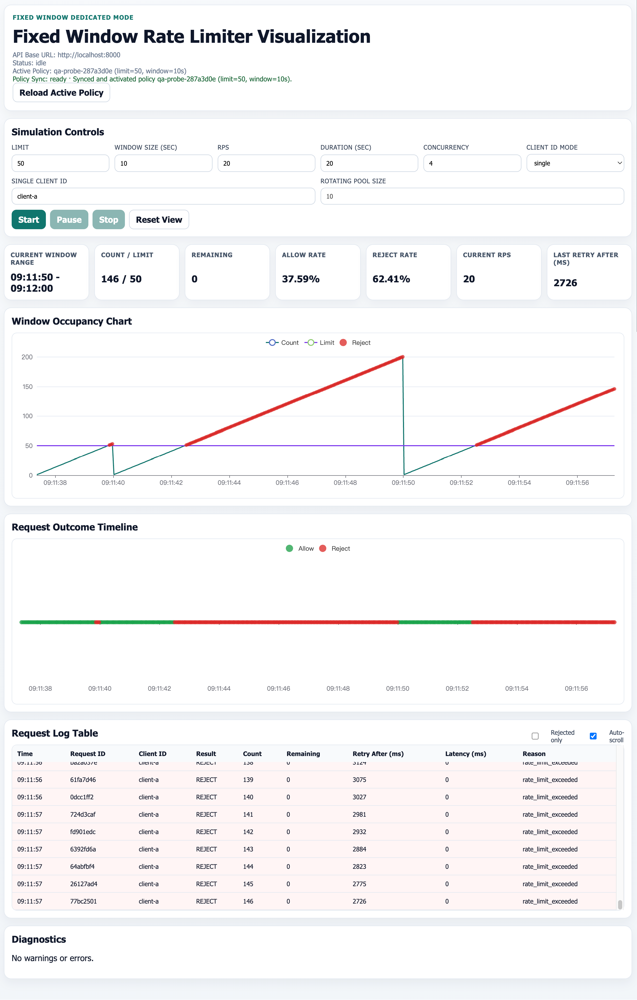

# API Gateway Rate Limiter Simulator

An industry-style, minimum-runnable simulation platform for comparing API gateway rate-limiting algorithms under controlled load.

## Project Description

This project provides an end-to-end environment to evaluate the behavior of five rate-limiting algorithms in a unified dashboard:

- Fixed Window
- Sliding Log
- Sliding Window Counter
- Token Bucket
- Leaky Bucket

The system is designed to make algorithm trade-offs visible through live request simulation, policy hot-switching, real-time metrics, and request-level logs.

## Architecture Overview

- **Backend**: FastAPI service with pluggable limiter engines
- **Runtime State**: Redis for counters, tokens, windows, and short-term metrics/log buffers
- **Policy Storage**: PostgreSQL for policy definitions, parameters, activation state, and optional experiment metadata
- **Frontend**: React + Vite dashboard for policy control, simulation orchestration, KPI cards, charting, and log inspection
- **Deployment**: Docker Compose for one-command local startup

## Core Goals

- Hot-switch active rate-limiting policy without restarting the backend
- Simulate configurable traffic rounds and burst patterns
- Visualize QPS, reject rate, and latency percentiles (including P99) in near real time
- Compare algorithm behavior under the same traffic profile

## Planned Repository Structure

```text
backend/     FastAPI app, limiters, services, migrations, tests
frontend/    React dashboard and simulation UI
infra/       Docker Compose and infrastructure wiring
```

## Implementation Contract

- Historical full-stack blueprint: `docs/IMPLEMENTATION_BLUEPRINT.md`
- Active backend-first incremental requirements: `docs/REQUIREMENTS_BACKEND_INCREMENTAL.md`

## Local Development with Docker

Start all services:

```bash
docker compose up --build
```

Or use the infra-scoped Compose file:

```bash
docker compose -f infra/docker-compose.yml up --build
```

Services:

- Frontend: http://localhost:5173
- Backend API: http://localhost:8000
- Backend health: http://localhost:8000/api/health

## Fixed Window Frontend Mode

The current frontend is a dedicated `Fixed Window` visualization page based on `docs/FRONTEND_FIXED_WINDOW_VISUALIZATION_SPEC.md`.

Page sections:

- Simulation Controls
- Realtime KPI Cards
- Window Occupancy Chart
- Request Outcome Timeline
- Request Log Table
- Diagnostics

### Simulation Controls

Inputs:

- `Limit`
- `Window Size (sec)`
- `RPS`
- `Duration (sec)`
- `Concurrency`
- `Client ID mode` (`single` / `rotating`)

Actions:

- `Start`
- `Pause` / `Resume`
- `Stop`
- `Reset View`

`Reset View` clears frontend chart/log buffers only.

### Real-Time Visualization Behavior

- Dispatches requests through `POST /api/simulate/request`.
- Consumes per-request `algorithm_state` for count/window rendering.
- Highlights reject moments in chart and timeline.
- Keeps an in-memory rolling buffer with max 2000 events.

## Frontend Validation Checklist

Run from `frontend/`:

```bash
npm install
npm run build
npm test
```

Expected:

- Build succeeds.
- All sanity tests pass.

Current sanity test files:

- `src/components/fixed-window/SimulationControls.test.tsx`
- `src/components/fixed-window/RequestLogTable.test.tsx`
- `src/hooks/useFixedWindowSimulation.test.tsx`

## Quick Demo Walkthrough (Fixed Window)

1. Start the stack with Docker Compose.
2. Open `http://localhost:5173`.
3. Set `limit=10`, `window=10`, `rps=20`, and run simulation.
4. Observe count reaching limit, rejects clustering in-window, and reset behavior at window boundaries.
5. Toggle `Rejected only` in the table and inspect `retry_after_ms` values.

## Latest Screenshot

The screenshot below reflects the current Fixed Window simulation controls page used by the frontend mode.


